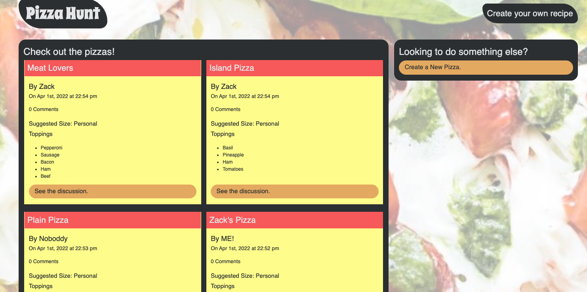
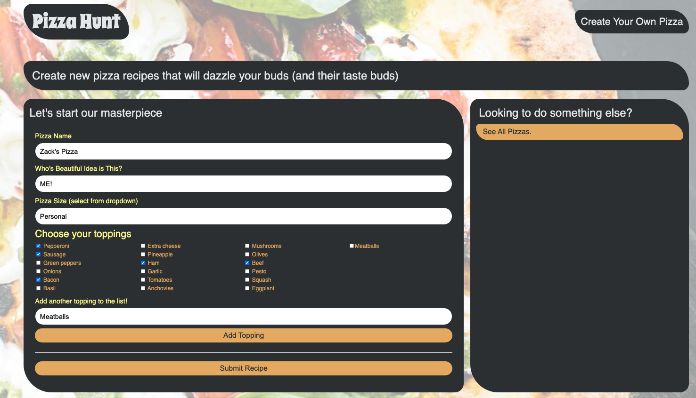
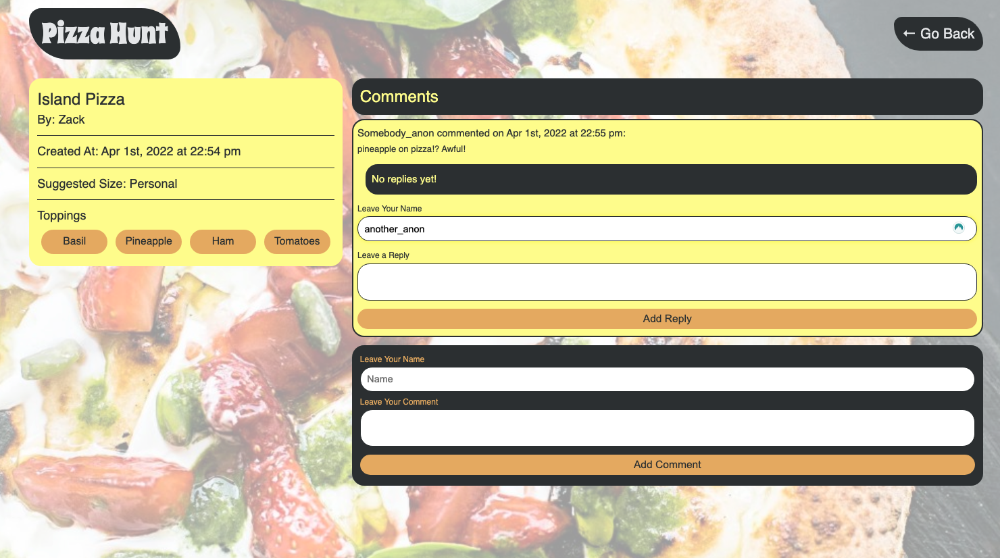

# Pizza-Hunt

## Description

Pizza-hunt is a social media recipe app where users post custom pizza ideas, as well as comment on the pizzas and react to comments. This application uses MongoDB for the non-structured database, Mongoose as the Object-Document Mapper, and IndexedDB for client-side storage in the browser  

## Table of Contents

- [Installation](#Installation)
- [Usage](#Usage)
- [License](#License)
- [Questions](#Questions)
- [Heroku](#Heroku)

## Installation

Clone the repository to your local machine. Run the command`npm init` followed by `npm i` to install the local dependencies needed for this project.

## Usage

From the root folder of this repository, run the command `node server.js`. To ensure you are using the app through the correct database, run `mongo` followed by `show databases` in a separate command line tab. You will see `pizza-hunt` as one of the options. `use pizza-hunt` will select this database to use. Access the website through localhost:3001 where all the functionality is available and data is saved

   
   
   

## License

A short and simple permissive license with conditions only requiring preservation of copyright and license notices. Licensed works, modifications, and larger works may be distributed under different terms and without source code.

## Questions

If you have any questions, concerns, or comments, feel free to contact me:

-GitHub: [Zacharycampanelli](https://github.com/Zacharycampanelli)  
-Email: [zaccamp@optonline.net](mailto:zaccamp@optonline.net)

## Heroku
View the deployed application [here](https://vast-lake-88299.herokuapp.com/)
